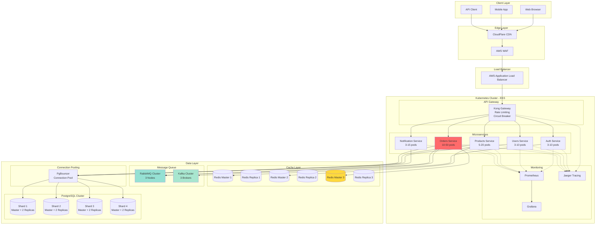
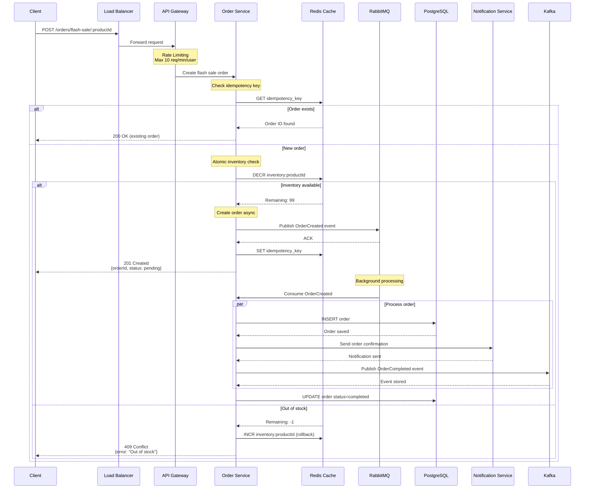
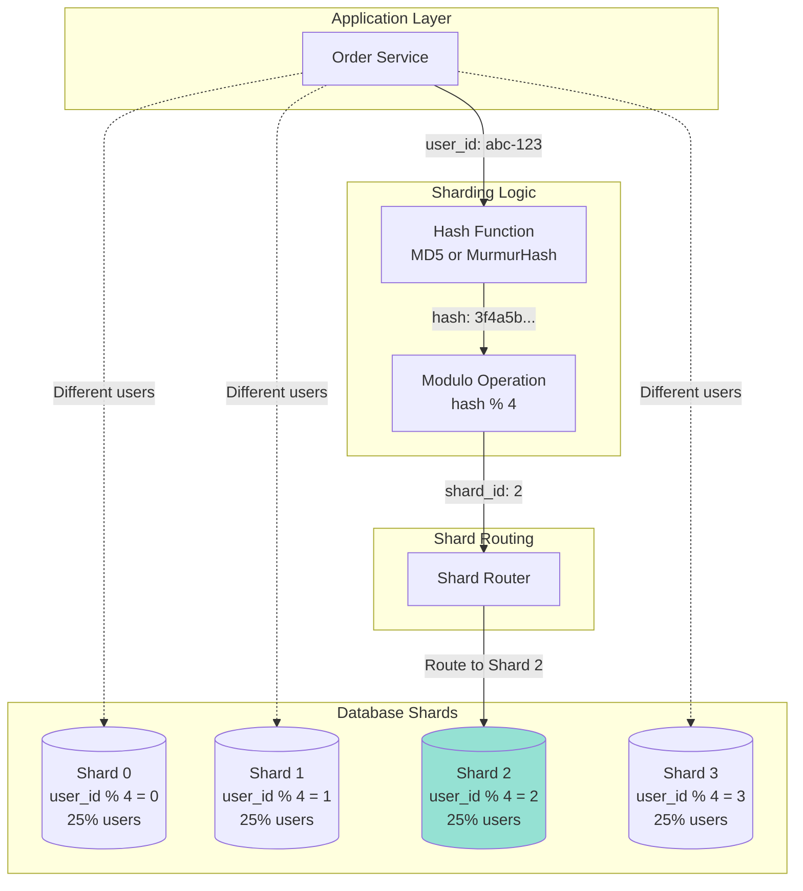
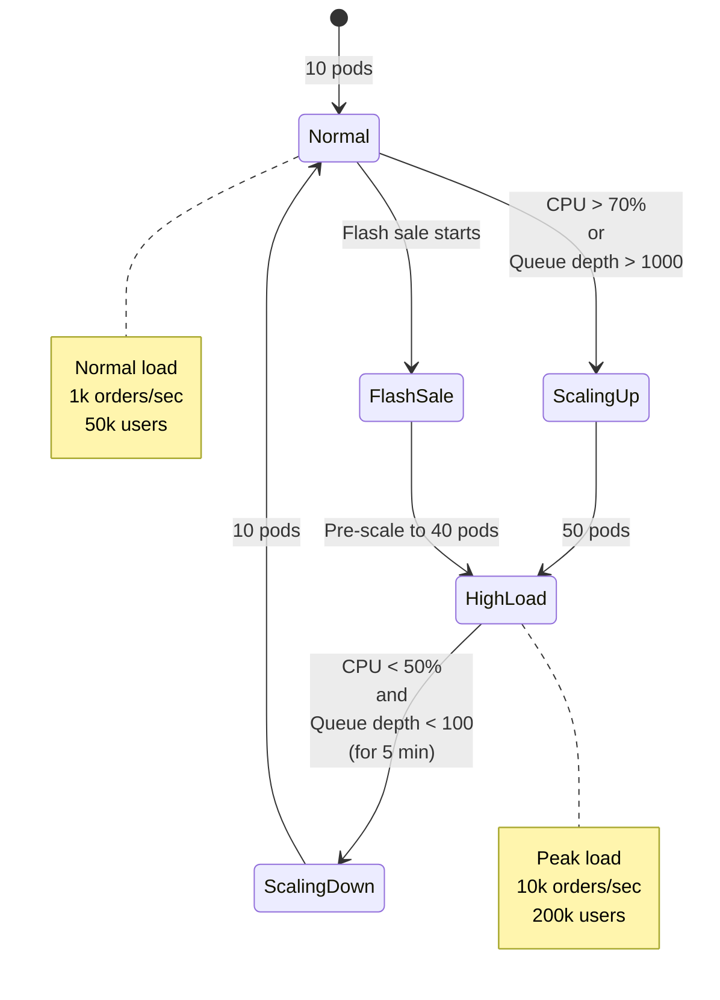
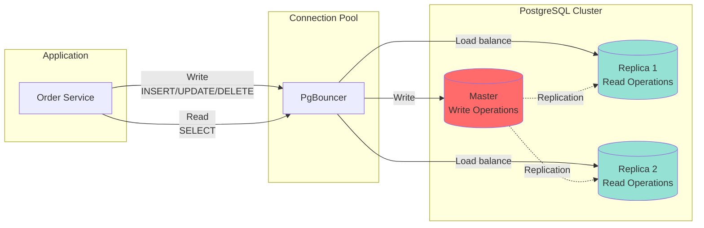
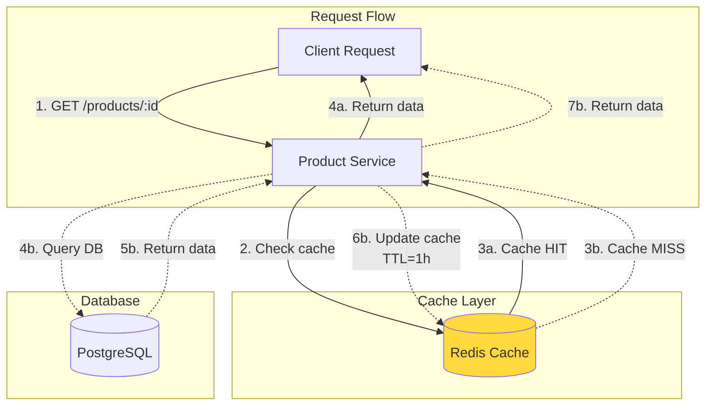
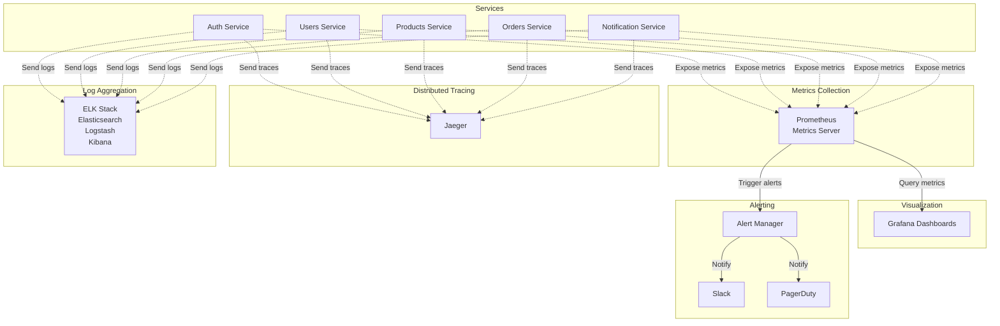
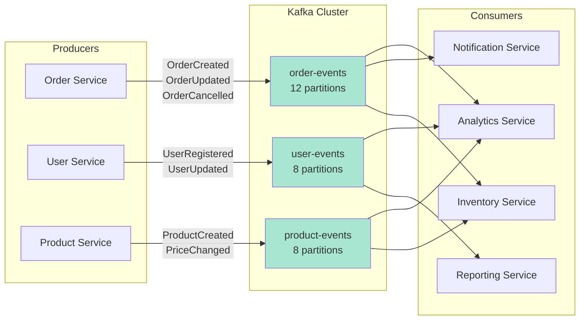

# System Architecture Diagrams

## High-Level Architecture

## Flash Sale Order Flow

## Database Sharding Strategy

## Auto-Scaling Flow

## Read/Write Splitting

## Cache Strategy

## Monitoring & Alerting

## Event-Driven Architecture (Kafka)

## Deployment Pipeline

```mermaid
graph LR
    subgraph "Development"
        Dev[Developer]
        Git[GitHub]
    end
    
    subgraph "CI Pipeline"
        Build[Build & Test]
        Docker[Build Docker Image]
        Push[Push to ECR]
    end
    
    subgraph "CD Pipeline"
        Deploy[Deploy to K8s]
        Test[Smoke Tests]
        Rollout[Rolling Update]
    end
    
    subgraph "Kubernetes"
        Staging[Staging Environment]
        Production[Production Environment]
    end
    
    subgraph "Monitoring"
        Monitor[Health Checks]
        Rollback[Auto Rollback]
    end
    
    Dev -->|Push code| Git
    Git -->|Trigger webhook| Build
    Build -->|Tests passed| Docker
    Docker -->|Push image| Push
    Push -->|Deploy manifest| Deploy
    Deploy -->|Deploy to| Staging
    Staging -->|Run tests| Test
    Test -->|Tests passed| Rollout
    Rollout -->|Rolling update| Production
    Production -->|Monitor health| Monitor
    Monitor -.->|Health check failed| Rollback
    Rollback -.->|Revert to previous| Production
    
    style Production fill:#95e1d3
```

